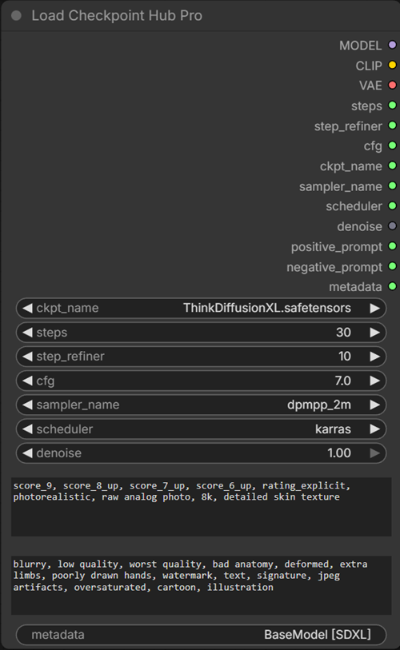

# Load Checkpoint Hub Pro

Central parameter hub that loads a checkpoint and routes MODEL, CLIP, VAE, steps, refiner steps, CFG, sampler algorithm, scheduler curve, denoise values, positive/negative prompts, and metadata across workflows.

  
